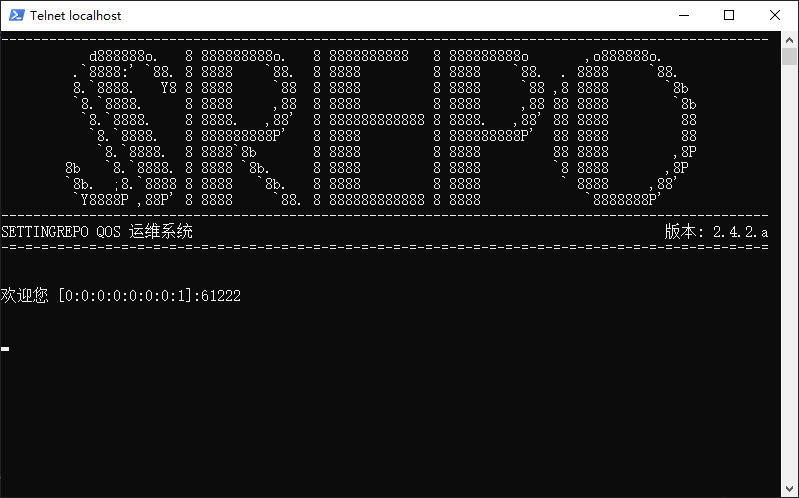
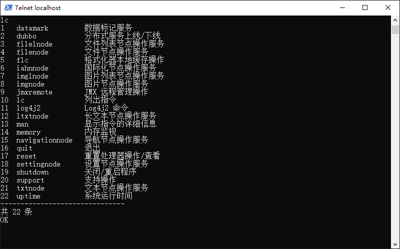

# settingrepo

Setting Repository (简称 Settingrepo) 是一个配置仓库。它是一个用于存放项目中的配置的仓库。

配置仓库提供 键-值 对的形式存放配置，用于系统和个性化的设置存取。其值支持多种类型，包括但不限于字符串、图片、文件等。

---

## 特性

- 使用 键-值 对的形式存放配置。
- 支持多种类型的值。
- 为不同类型的值提供相应的操作服务，调用方便。
- 提供 Telqos 运维平台，能够在没有 GUI 的环境下使用本服务的功能。
- 支持主流关系型数据库（基于 Hibernate）。
- 使用 FTP 服务器存储文件或 BLOB。
- 支持分布式部署。

## 文档

该项目的文档位于 [docs](./docs) 目录下，包括：

### wiki

wiki 为项目的开发人员为本项目编写的详细文档，包含不同语言的版本，主要入口为：

1. [简介](docs/wiki/zh-CN/Introduction.md) - 镜像的 `README.md`，与本文件内容基本相同。
2. [目录](docs/wiki/zh-CN/Contents.md) - 文档目录。

## 运行截图

Telnet 运维平台 banner：



Telnet 运维平台指令合集：



## 支持的值类型

- 文本。
- 长文本。
- 图片。
- 图片列表。
- 国际化。
- 文件。
- 文件列表。
- 导航。

## 安装说明

1. 下载源码

   使用 git 进行源码下载。

   ```shell
   git clone git@github.com:DwArFeng/settingrepo.git
   ```

   对于中国用户，可以使用 gitee 进行高速下载。

   ```shell
   git clone git@gitee.com:dwarfeng/settingrepo.git
   ```

2. 项目打包

   进入项目根目录，执行 maven 命令。

   ```shell
   mvn clean package
   ```

3. 解压

   找到打包后的目标文件。

   ```
   settingrepo-node/target/settingrepo-node-[version]-release.tar.gz
   ```

   将其解压至 windows 系统或者 linux 系统。

4. 配置

   1. 修改 `conf` 文件夹下的配置文件，着重修改各连接的 url 与密码。

5. enjoy it

## 分布式说明

该项目使用 `dubbo` 作为 RPC 框架，本身支持分布式，您可以在实际使用时，部署该项目任意数量，以进行分布式运算。
